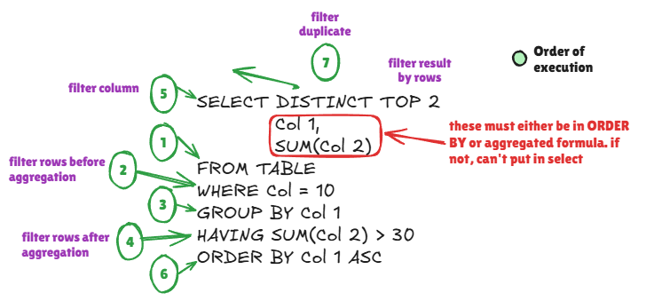

# Querying Data


### 📑 Table of Contents
- [1️⃣ SELECT Basics](#1️⃣-select-basics)
- [2️⃣ Filtering Data with WHERE](#2️⃣-filtering-data-with-where)
- [3️⃣ Sorting Results with ORDER BY](#3️⃣-sorting-results-with-order-by)
- [4️⃣ Limiting and Distinct](#4️⃣-limiting-and-distinct)
- [5️⃣ Order of Execution](#5️⃣-order-of-execution)

---

## 1️⃣ SELECT Basics
The `SELECT` statement retrieves data from one or more tables.

```sql
SELECT column1, column2
FROM employees;
```

### 5️⃣ Order of Execution



This diagram illustrates the order of SQL query execution. Although we write queries starting with SELECT, the database actually processes them in a different sequence.